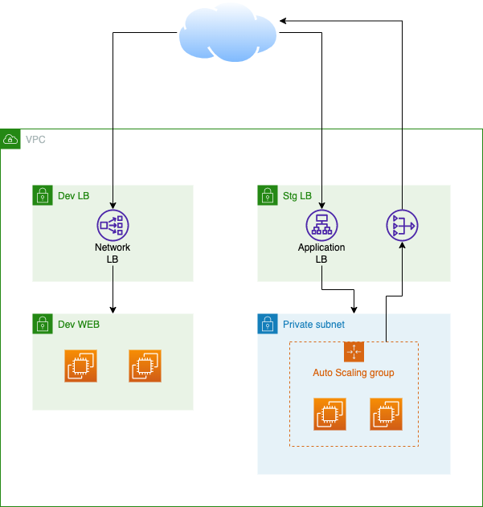

# Terraform Study T101
# Terraform NCP

NCP(Naver Cloud Platform)에서 Terraform을 이용한 프로비저닝에 대해서 다룹니다.

## Architecture

## Global 구성
  VPC 및 Subnet은 Global로 분리하여 Dev, Stg에서 terraform_remote_state로 읽어와서 사용하도록 합니다.

  1. VPC - 192.168.0.0/16 생성
  2. dev LB subnet - 192.168.10.0/24 생성
  3. dev web subnet - 192.168.11.0/24 생성
  4. stg LB subnet - 192.168.100.0/24 생성
  5. stg web subnet - 192.168.101.0/24 생성

* [가이드](global.md)

## DEV
  - 서버 배포에 약 15분 정도 소요됩니다.
  - 전체 생성 후 정상화 되는 데 5분 정도 소요됩니다.
  - 외부 통신을 위해 서버에 공인 IP를 할당 합니다.

  1. Web Server 2대 생성
  2. Network Loadbalancer 1대 생성
  3. Netowkr Loadbalancer를 이용해 Web Service

## STG
  - 서버 배포에 약 15분 정도 소요됩니다.
  - 전체 생성 후 정상화 되는 데 5분 정도 소요됩니다.
  - 외부 통신을 위해 Nat Gateway를 구성합니다..

  1. Nat Gateway 1대 생성
  2. ASG를 이용하여 Web Server 2대 생성
  3. Application Loadblanacer 1대 생성
  4. Application Loadblanacer를 이용해 Web Service
